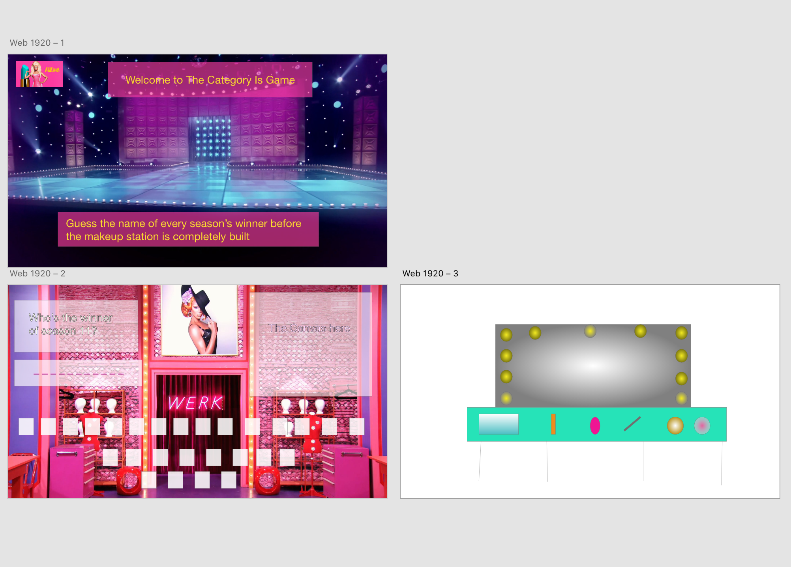

# The Category Is....

### Overview:
This is a game with a similar concept to hangman. In my view, hangman is not appropriate during this time and I came up with this game. It follows the same rules but you build a green room (a makeup station) instead.

## Game Rules:
This is based on RuPaul Drag Race contestant's names; the player tries to guess what's the name of every season's winner  one letter at a time. There will be dashes equivalent to the number of letters in the drag queen's name. If a guessing player suggests a letter that occurs in the word, the blank with that letter will be filled in the right places. If the player guesses a wrong letter, the makeup station will be built one item at a time. The player will have 10 attempts to guess or the makeup station is complete and the player loses. 

### Tech Challenges:
1- Building a canvas with all the items flush and recognizable.
2- Making sure all the elements are aligned.
3- Time!!!

### Additional Features:
Setting up a second player to guess where the right letter will be placed at.

### Timeline:
07/01 : Gaining the approval and start setting up the HTML, CSS and JS layout. Pseudocode.

07/02 : Start building the actors and come up with a plan for the action.

07/03 : Work on the action.

07/04 : Continue working on the JS code and test it.

07/05 : Finish up the CSS and all the other elements and submit the project hopefull by the end of the day. 

